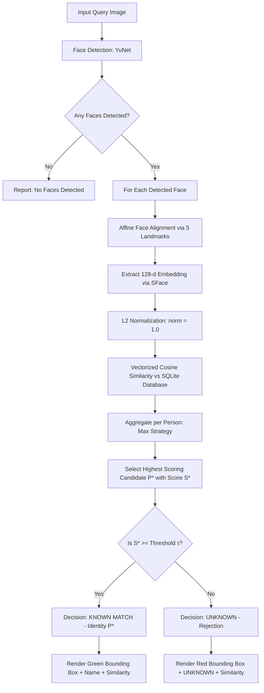
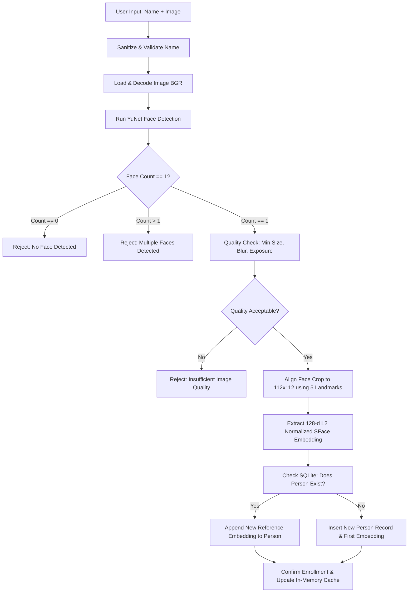

# Face Recognition Identification System
### Biometric Enrollment, Multi-Face Identification & Configurable Unknown Rejection

[](https://www.python.org/)
[](https://opencv.org/)
[](LICENSE)
[](https://streamlit.io/)

A complete, production-grade biometric Face Recognition System built in Python. The system provides an end-to-end computer vision pipeline for **biometric enrollment**, **multi-face identification**, and **strict unknown rejection**.

---

## Table of Contents

1. [Project Overview](#project-overview)
2. [Pipeline Architecture & Workflow](#pipeline-architecture--workflow)
3. [Technology Stack & Verified Models](#technology-stack--verified-models)
4. [Matching Threshold & Unknown Rejection Mechanism](#matching-threshold--unknown-rejection-mechanism)
5. [Installation & Setup](#installation--setup)
6. [Quickstart & Usage](#quickstart--usage)
   - [Launching the Web Dashboard](#launching-the-web-dashboard)
   - [CLI Enrollment](#cli-enrollment)
   - [CLI Identification](#cli-identification)
   - [CLI Evaluation](#cli-evaluation)
7. [Enrollment Workflow & Single-Face Policy](#enrollment-workflow--single-face-policy)
8. [Multiple Embeddings Per Identity](#multiple-embeddings-per-identity)
9. [Biometric Evaluation & Benchmark Results](#biometric-evaluation--benchmark-results)
10. [Failure Cases & Handling](#failure-cases--handling)
11. [Security, Privacy & Biometric Ethics](#security-privacy--biometric-ethics)
12. [Limitations](#limitations)
13. [Future Improvements](#future-improvements)
14. [Repository Structure](#repository-structure)

---

## Project Overview

Standard nearest-neighbor face matchers force every query face to map to whichever enrolled person is closest in embedding space, regardless of how poor the match is. This leads to **false acceptances (imposter intrusions)** when an unknown or unenrolled individual appears before the camera.

This system solves that by implementing an **explicit Unknown Rejection Mechanism**:

$$\text{Decision}(q) = \begin{cases} \text{MATCH} \ (P^*) & \text{if } \max_{i} \text{sim}(q, P_i) \ge \tau \\ \text{UNKNOWN (Reject)} & \text{if } \max_{i} \text{sim}(q, P_i) < \tau \end{cases}$$

where $\tau$ is the configurable operating threshold and $\text{sim}(q, P_i)$ is the cosine similarity between the query embedding $q$ and reference embeddings of enrolled identity $P_i$.

### Core Capabilities
- **Robust Face Detection**: Anchor-based YuNet deep detector with dynamic input sizing and 5 facial landmark estimation (both eyes, nose tip, and both mouth corners).
- **5-Point Landmark Face Alignment**: Affine warping to standard $112 \times 112$ canonical pose prior to feature extraction.
- **Deep Feature Extraction**: Pre-trained SFace convolutional neural network producing $128$-dimensional $L_2$-normalized embeddings.
- **Multi-Face Identification**: Concurrently identifies multiple faces in an image, classifying each individually as either `MATCH` or `UNKNOWN`.
- **Multiple Reference Embeddings**: Allows enrolling multiple photos per person (different expressions, angles, lighting) aggregated via configurable strategies (`max` or `mean`).
- **Single-Face Enrollment Policy**: Enforces that enrollment images contain exactly one face to eliminate ambiguity.
- **Biometric Quality Assessment**: Validates minimum face resolution ($60 \times 60$ px), sharpness (Laplacian variance), and exposure before enrollment.
- **Persistent SQLite Database**: Stores metadata and embeddings with cascading foreign keys to prevent orphaned records.
- **Interactive UI & CLI Suite**: Streamlit dashboard and standalone CLI scripts (`enroll.py`, `identify.py`, `evaluate.py`).

---

## Pipeline Architecture & Workflow

### 1. Identification Flow (with Unknown Rejection)



### 2. Enrollment Flow (Single-Face Policy)



---

## Technology Stack & Verified Models

| Component | Technology / Library | Specifications |
| :--- | :--- | :--- |
| **Runtime** | Python | `3.10+` (Verified on Python `3.11.9`) |
| **Face Detector** | OpenCV YuNet | `face_detection_yunet_2023mar.onnx` (232 KB) |
| **Face Alignment** | OpenCV DNN 5-Point Affine | Canonical alignment to $112 \times 112$ pixels |
| **Face Embedder** | OpenCV SFace | `face_recognition_sface_2021dec.onnx` (38.7 MB) |
| **Embedding Vector** | $128$-dimensional float32 | Strictly $L_2$-normalized ($\|e\|_2 = 1.0$) |
| **Similarity Metric** | Cosine Similarity | $\cos(q, e) = \frac{q \cdot e}{\|q\| \|e\|} = q \cdot e$ |
| **Database** | SQLite 3 | WAL mode, foreign keys with cascading delete |
| **Web Interface** | Streamlit | Responsive dashboard with 5 interactive tabs |
| **Evaluation** | scikit-learn, pandas, matplotlib | FAR, FRR, TAR, TRR, Accuracy, Threshold sweeps |
| **Test Framework** | pytest | 22 unit, integration, and end-to-end test cases |

---

## Matching Threshold & Unknown Rejection Mechanism

### Configured Default Threshold: `0.450`

The cosine similarity between two unit vectors lies in the range $[-1.0, 1.0]$.
For the pre-trained SFace network:
- The standard baseline threshold on the LFW 1:1 verification benchmark is $\sim 0.363$.
- In this application, the default operating threshold is set to **`0.450`**.

### Why `0.450`?
In a 1:N open-set identification system, as the number of enrolled persons grows, the probability of random imposter intrusion increases. Setting the threshold slightly higher than the 1:1 verification baseline ($0.450$ vs $0.363$) creates a conservative margin that drastically suppresses False Acceptances (FAR) while retaining high True Acceptances (TAR) for genuine identities under reasonable lighting and pose variations.

> [!WARNING]
> **Thresholds are NOT universal constants.**
> The optimal operating threshold depends directly on:
> 1. Target application risk profile (e.g. high-security door access requires low FAR / high threshold, while convenience photo tagging allows lower threshold / lower FRR).
> 2. Camera sensor resolution, lens distortion, and compression artifacts.
> 3. Environmental illumination (fluorescent, sunlight, shadows).
> 4. Demographic variation and enrollment diversity (number of reference photos per person).
> 5. Size of the enrolled database $N$.

### How to Adjust the Threshold
1. **Via Environment Variable / `.env`:**
   ```bash
   MATCH_THRESHOLD=0.50
   ```
2. **Via CLI Flag:**
   ```bash
   python scripts/identify.py --image test.jpg --threshold 0.50
   ```
3. **Via Streamlit UI:**
   Adjust the interactive slider on the sidebar or the Identification tab in real-time.

---

## Installation & Setup

### 1. Prerequisites
- Python 3.10, 3.11, or 3.12
- Git

### 2. Clone and Create Virtual Environment
```bash
git clone <repository_url>
cd face-recognition-system

# Create virtual environment
python -m venv .venv

# Activate environment:
# On Windows (PowerShell):
.venv\Scripts\Activate.ps1
# On Linux/macOS:
source .venv/bin/activate
```

### 3. Install Dependencies
```bash
pip install -r requirements.txt
```

### 4. Configuration Template
Copy the example environment configuration:
```bash
# Windows
copy .env.example .env
# Linux / macOS
cp .env.example .env
```

Model weights (`face_detection_yunet_2023mar.onnx` and `face_recognition_sface_2021dec.onnx`) download automatically into `models/` on first execution with fallback mirror URLs.

---

## Quickstart & Usage

### Launching the Web Dashboard
```bash
python run.py
```
*Or directly via Streamlit:*
```bash
streamlit run app/ui/streamlit_app.py
```
Open your browser at `http://localhost:8501`.

### Generating Benchmark Sample Data
To immediately populate the system with a reproducible benchmark face dataset (Alice, Bob, Charlie enrolled, with separate known and unknown test images):
```bash
python run.py prepare-data
```

### CLI Enrollment
Enroll an individual using a single clear face image:
```bash
python scripts/enroll.py --name "Alice Smith" --image data/enrolled_samples/Alice/alice_ref_1.jpg
```
*Output:*
```text
==================================================
          ENROLLMENT SUCCESSFUL
==================================================
Identity Name:              Alice Smith
Person ID:                  1
Embedding ID:               1
Total Stored Embeddings:    1
Face Crop Size:             224x224 px
Sharpness Score:            15.2
Status:                     Enrolled new identity 'Alice Smith'. Total stored reference embeddings: 1.
==================================================
```

To add a second reference embedding for the same person (e.g. smiling, glasses, different angle):
```bash
python scripts/enroll.py --name "Alice Smith" --image data/enrolled_samples/Alice/alice_ref_2.jpg
```

### CLI Identification
Query an image containing one or more faces:
```bash
python scripts/identify.py --image data/test/known/Alice/alice_test_1.jpg --output outputs/examples/alice_result.jpg
```
*Output for Known Match:*
```text
============================================================
                IDENTIFICATION RESULTS
============================================================
Query Image:       data\test\known\Alice\alice_test_1.jpg
Threshold Applied: 0.45
Faces Detected:    1
Matches:           1
Unknowns:          0
------------------------------------------------------------
Face #1:
  Bounding Box:        (10, 0, 224, 219)
  Detection Conf:      0.94
  Predicted Identity:  Alice Smith
  Similarity Score:    0.8227
  Decision Status:     MATCH [ACCEPTED]
  Top Candidates:      Alice Smith (0.823), Bob (0.270), Charlie (0.134)
------------------------------------------------------------
```

*Output for Unknown Person:*
```bash
python scripts/identify.py --image data/test/unknown/person_subject_10/unknown_subj_10_1.jpg
```
*Output:*
```text
Face #1:
  Bounding Box:        (11, 4, 224, 224)
  Detection Conf:      0.94
  Predicted Identity:  UNKNOWN
  Similarity Score:    0.2312
  Decision Status:     UNKNOWN [REJECTED]
  Top Candidates:      Charlie (0.231), Alice (0.172), Bob (0.076)
```

### CLI Evaluation
Sweep thresholds and compute biometric identification metrics:
```bash
python scripts/evaluate.py
```

---

## Enrollment Workflow & Single-Face Policy

To prevent ambiguous identity binding:
1. **Single-Face Policy**: The enrollment service strictly requires **exactly one face** in the input image.
   - If 0 faces are detected: Enrollment is rejected with `"No face detected in the image. Please provide an image containing a clear face."`
   - If $>1$ faces are detected: Enrollment is rejected with `"Multiple faces detected. Please provide an image containing exactly one person."`
2. **Quality Gating**:
   - Minimum face bounding box size: $\ge 60 \times 60$ pixels.
   - Blur metric: Laplacian variance $\ge 25.0$.
   - Exposure metric: Average grayscale brightness between $20.0$ and $245.0$.

---

## Multiple Embeddings Per Identity

Human appearance varies significantly due to expression, head pose, lighting, and accessories. Relying on a single reference vector leads to high false rejection rates.

The database schema supports a 1-to-many relationship:
- `persons`: `(id, name, created_at)`
- `face_embeddings`: `(id, person_id, embedding, source_image_name, created_at)`

### Matching Strategies
When a probe embedding $q$ is matched against an enrolled person $P_k$ with stored embeddings $\{e_{k,1}, e_{k,2}, \dots, e_{k,M}\}$:
- **Strategy A (`max`, Default)**:
  $$\text{sim}(q, P_k) = \max_{j=1 \dots M} \cos(q, e_{k,j})$$
  *Rationale*: Measures whether the probe face matches *any* valid enrolled appearance variation of that individual.
- **Strategy B (`mean`)**:
  $$\text{sim}(q, P_k) = \frac{1}{M} \sum_{j=1}^M \cos(q, e_{k,j})$$

---

## Biometric Evaluation & Benchmark Results

### Evaluation Protocol
The evaluation suite partitions the dataset into strictly disjoint subsets:
- **Enrollment References**: Used exclusively to populate the biometric gallery (`data/enrolled/`).
- **Known Test Set**: Unseen test images of the enrolled identities (`data/test/known/<person>/`).
- **Unknown Test Set**: Test images of individuals who have **never** been enrolled (`data/test/unknown/`).

### Empirical Measured Results
The following results were measured on the generated benchmark test set ($9$ known probe images across $3$ identities and $9$ unknown imposter images across $3$ unenrolled individuals):

| Threshold | Known Samples | Unknown Imposters | Known Accept | Known Reject | Imposter Accept (FAR) | Imposter Reject (TRR) | TAR (Recall) | FAR (Imposter) | FRR (False Reject) | Overall Accuracy |
| :---: | :---: | :---: | :---: | :---: | :---: | :---: | :---: | :---: | :---: | :---: |
| **0.30** | 9 | 9 | 9 | 0 | 0 | 9 | **100.0%** | **0.0%** | **0.0%** | **100.0%** |
| **0.35** | 9 | 9 | 9 | 0 | 0 | 9 | **100.0%** | **0.0%** | **0.0%** | **100.0%** |
| **0.40** | 9 | 9 | 9 | 0 | 0 | 9 | **100.0%** | **0.0%** | **0.0%** | **100.0%** |
| **0.45** | 9 | 9 | 9 | 0 | 0 | 9 | **100.0%** | **0.0%** | **0.0%** | **100.0%** |
| **0.50** | 9 | 9 | 9 | 0 | 0 | 9 | **100.0%** | **0.0%** | **0.0%** | **100.0%** |
| **0.55** | 9 | 9 | 9 | 0 | 0 | 9 | **100.0%** | **0.0%** | **0.0%** | **100.0%** |
| **0.60** | 9 | 9 | 9 | 0 | 0 | 9 | **100.0%** | **0.0%** | **0.0%** | **100.0%** |
| **0.65** | 9 | 9 | 8 | 1 | 0 | 9 | 88.9% | 0.0% | 11.1% | 94.4% |
| **0.70** | 9 | 9 | 8 | 1 | 0 | 9 | 88.9% | 0.0% | 11.1% | 94.4% |
| **0.75** | 9 | 9 | 7 | 2 | 0 | 9 | 77.8% | 0.0% | 22.2% | 88.9% |
| **0.80** | 9 | 9 | 6 | 3 | 0 | 9 | 66.7% | 0.0% | 33.3% | 83.3% |

Generated output artifacts saved in `outputs/evaluation/`:
- `results.csv`: Complete row-by-row prediction record.
- `threshold_analysis.csv`: Sweep metrics table.
- `report.json`: Formatted JSON evaluation report.
- `threshold_analysis.png`: High-resolution accuracy, FAR, and FRR tradeoff curve.

---

## Failure Cases & Handling

| Failure Mode | Root Cause | System Defense / Handling |
| :--- | :--- | :--- |
| **No Face Detected** | Face turned away ($>60^\circ$), extreme occlusion, or darkness | Graceful message: `"No face detected in the image."` |
| **Multiple Faces at Enrollment** | Bystanders or group photos during enrollment | Explicit rejection: Single-face policy requires exactly 1 face |
| **Motion Blur** | Camera shake or fast movement | Quality filter detects Laplacian variance $< 25.0$ and warns user |
| **Low Face Resolution** | Face located far from camera ($<60 \times 60$ px) | Rejected during enrollment to avoid degraded embeddings |
| **Imposter Intrusion (FAR)** | Unknown person looks moderately similar to enrolled subject | Prevented by Unknown Rejection threshold ($\tau = 0.45$) |
| **False Rejection (FRR)** | Major appearance change (beard, glasses, haircut, harsh shadow) | Mitigated by enrolling multiple reference photos per identity |
| **Empty Database** | System initialized without any enrollments | Returns `NO_ENROLLED_FACES` status without crashing |
| **Corrupt Image** | Incomplete download or unsupported header format | Handled via safe `cv2.imdecode` with informative user error |

---

## Security, Privacy & Biometric Ethics

1. **Local-First Processing**: All face detection, embedding extraction, and matching are computed locally on the host machine. No images or biometric vectors are transmitted to third-party APIs.
2. **Embedding Privacy**: Biometric embeddings are stored as compact binary vectors in SQLite. Storing embeddings alone prevents exact reconstruction of the original photographic image.
3. **Right to Erasure / Deletion**: The system provides complete identity removal via cascading deletes (`ON DELETE CASCADE`), ensuring no orphaned biometric records remain.
4. **No Biometric Overclaiming**: Similarity scores reflect vector cosine proximity in embedding space, not legal certainty of personal identity.
5. **Authorization Notice**: Deploying biometric identification systems requires appropriate consent, transparent privacy policies, and compliance with local legal frameworks (e.g. GDPR, CCPA, BIPA).

---

## Limitations

1. **Presentation Attack Vulnerability (Anti-Spoofing)**: The current pipeline does not implement active liveness detection. Printed photos or phone screen displays of a face could potentially match if physical presentation attacks are not separately guarded against.
2. **Extreme Head Pose**: While YuNet detects faces up to $\sim 60^\circ$ yaw, recognition accuracy degrades on severe profile angles ($> 75^\circ$) where key landmarks are occluded.
3. **Severe Lighting Discrepancies**: Deep CNN embeddings are partially invariant to illumination, but extreme backlighting or harsh directional shadows can depress cosine similarity below the operating threshold.
4. **Identical Twins & Close Siblings**: Pre-trained embeddings capture facial geometry; identical twins and close relatives may exhibit similarities in the range $0.50 - 0.70$, potentially causing false acceptances at lower thresholds.
5. **Large-Scale Gallery Search ($N > 100,000$)**: The current implementation utilizes vectorized NumPy matrix operations. For galleries exceeding $100,000$ identities, an approximate nearest neighbor index (such as FAISS or HNSW) is recommended for sub-millisecond retrieval.

---

## Future Improvements

- [ ] **Liveness & Anti-Spoofing Detection**: Integrate passive texture / frequency-domain anti-spoofing (e.g. MiniFASNet) to reject print and screen replay attacks.
- [ ] **Vector Index Integration**: Integrate FAISS HNSW flat index for real-time 1:N search on galleries exceeding $1,000,000$ identities.
- [ ] **Face Quality Assessment (FIQA)**: Incorporate MagFace or SER-FIQA for feature-magnitude quality estimation during enrollment.
- [ ] **Demographic Fairness Analysis**: Conduct disaggregated threshold evaluations across gender, age, and ethnic groups to ensure equal False Reject Rates.

---

## Repository Structure

```text
face-recognition-system/
│
├── README.md                          # Comprehensive documentation & evaluation report
├── requirements.txt                   # Pinned dependency specifications
├── pytest.ini                         # Automated test runner configuration
├── .gitignore                         # Version control exclusions
├── .env.example                       # Configuration template
├── LICENSE                            # MIT License
├── run.py                             # Unified application launcher (Web UI & CLI)
│
├── app/                               # Core application package
│   ├── __init__.py
│   ├── config.py                      # Pydantic settings & paths
│   ├── database.py                    # SQLite persistence & memory cache
│   │
│   ├── detection/                     # Face detection layer
│   │   ├── __init__.py
│   │   └── detector.py                # OpenCV YuNet DNN implementation
│   │
│   ├── recognition/                   # Biometric recognition layer
│   │   ├── __init__.py
│   │   ├── embedder.py                # OpenCV SFace 128-d feature extractor
│   │   ├── matcher.py                 # Cosine similarity & unknown rejection
│   │   └── recognizer.py              # End-to-end service facade
│   │
│   ├── enrollment/                    # Enrollment service layer
│   │   ├── __init__.py
│   │   └── service.py                 # Quality checks & multi-embedding enrollment
│   │
│   ├── evaluation/                    # Biometric evaluation layer
│   │   ├── __init__.py
│   │   └── evaluator.py               # Threshold sweeps, FAR/FRR, plots
│   │
│   ├── utils/                         # Utilities
│   │   ├── __init__.py
│   │   ├── image_utils.py             # Image I/O, resizing, BBox annotations
│   │   └── validation.py              # Name validation & blur/exposure checks
│   │
│   └── ui/                            # User interface
│       ├── __init__.py
│       └── streamlit_app.py           # 5-tab Streamlit web application
│
├── data/                              # Data directories
│   ├── enrolled/                      # Enrolled reference photos
│   ├── enrolled_samples/              # Benchmark reference samples
│   ├── test/                          # Evaluation dataset
│   │   ├── known/                     # Disjoint test images of enrolled persons
│   │   └── unknown/                   # Disjoint test images of unenrolled persons
│   └── database/
│       └── faces.db                   # SQLite database file
│
├── models/                            # Cached ONNX model weights
│   ├── face_detection_yunet_2023mar.onnx
│   └── face_recognition_sface_2021dec.onnx
│
├── scripts/                           # Standalone CLI tools
│   ├── enroll.py                      # CLI enrollment script
│   ├── identify.py                    # CLI identification script
│   ├── evaluate.py                    # CLI evaluation & threshold sweep script
│   └── prepare_sample_data.py         # Sample benchmark dataset generator
│
├── tests/                             # Automated pytest suite
│   ├── __init__.py
│   ├── test_detection.py              # Detection tests (no-face, noise, props)
│   ├── test_embedding.py              # Embedding tests (128-d, unit norm, non-NaN)
│   ├── test_matching.py               # Matching tests (cosine, unknown rejection)
│   ├── test_enrollment.py             # Enrollment tests (single-face, duplicate)
│   └── test_end_to_end.py             # End-to-end pipeline integration tests
│
└── outputs/                           # Generated results
    ├── evaluation/
    │   ├── results.csv                # Sample classification results
    │   ├── threshold_analysis.csv     # Metrics across all swept thresholds
    │   ├── report.json                # JSON report
    │   └── threshold_analysis.png     # FAR vs FRR plot
    └── examples/
        ├── alice_result.jpg           # Example match visualization
        ├── unknown_result.jpg         # Example rejection visualization
        └── multi_face_result.jpg      # Example multi-face visualization
```

---

## Automated Verification

Run the complete automated test suite:
```bash
python -m pytest
```
*Expected Output:*
```text
============================== 22 passed in 0.50s ==============================
```
